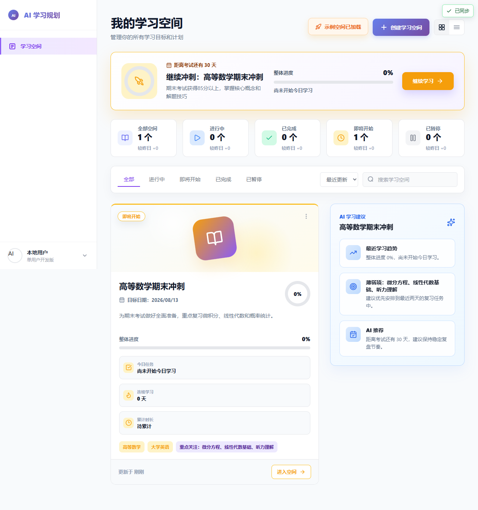
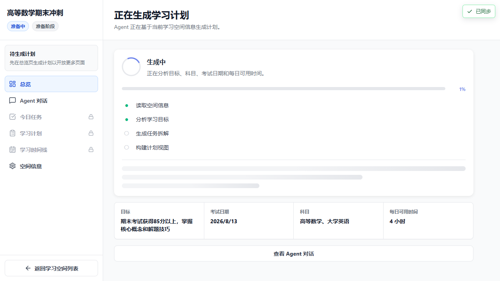
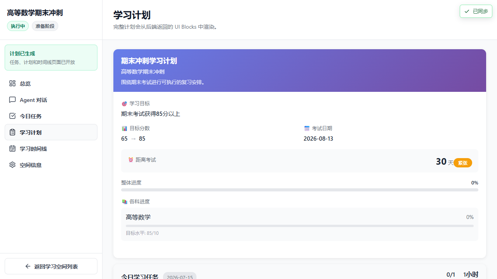
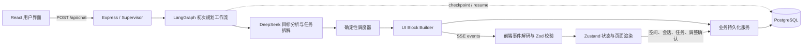

# AI 学习规划 Agent

面向 AI 全栈岗位的学习规划作品。用户创建或加载学习空间后，系统通过 SSE 展示 Agent 执行过程，由 LLM 拆解学习任务，再由确定性调度器生成可复现日程，最终通过 UI Blocks 展示并持久化到 PostgreSQL。

> 当前版本：`v1.0.0-portfolio` 候选版本。本项目采用前后端双仓库，本仓库是作品主页；[后端仓库](https://github.com/wukaizzz/learning-plan-agent-backend)承载 Express、LangGraph、DeepSeek 与 PostgreSQL。

## 作品截图

| 学习空间 | SSE 生成过程 | 最终计划 |
| --- | --- | --- |
|  |  |  |

截图由 Playwright 作品集 Smoke Test 的固定 HTTP/SSE fixture 生成，可通过 `CAPTURE_PORTFOLIO_SCREENSHOTS=1 pnpm test:e2e` 重现。

## 核心闭环

1. 创建或加载一份学习空间。
2. 前端调用 `/api/chat`，通过 SSE 接收工作流步骤和 Agent 执行事件。
3. DeepSeek 负责目标分析、风险判断和任务框架拆解。
4. 确定性调度器根据考试日期、每日容量和依赖关系安排具体日期。
5. 后端构建 `summary-card`、`daily-task-list`、`study-timeline` 等 UI Blocks。
6. PostgreSQL 保存空间、聊天、计划、任务、Block 与调整变更集；LangGraph checkpoint 独立保存工作流恢复状态。
7. 用户可以查询日程、生成调整预览，并显式拒绝或确认应用新计划版本。



## 功能完成矩阵

| 能力 | 状态 | 说明 |
| --- | --- | --- |
| 学习空间创建、编辑、暂停/恢复、软删除与恢复 | 已完成 | 单用户开发身份 |
| SSE 工作流步骤与 Agent 执行过程 | 已完成 | 非法事件诊断后跳过；旧 `field` 字段兼容 |
| 缺失信息收集与 `resume-stream` | 已完成 | collection-form 可中断并继续工作流 |
| LLM 任务拆解 + 确定性排程 | 已完成 | 最终日期不直接依赖自由文本输出 |
| UI Blocks 计划展示 | 已完成 | Block 入库前经 Zod 校验，支持 add/update/remove |
| PostgreSQL 空间、聊天、计划与任务持久化 | 已完成 | 刷新后从服务端恢复 |
| 日程查询 | 已完成 | 通过只读 Agent 工具返回 message-scoped Block |
| 调整预览、拒绝、确认应用 | 已完成 | 确认后创建新版本并归档旧计划 |
| 自动化质量门禁 | 已完成 | ESLint、Vitest、构建、Playwright、后端 Node Test |
| 登录认证、公开部署、完整复盘、分享导出、全量重规划 | 非目标 | 不在 v1.0 作品范围内 |

## 技术栈

- 前端：React 19、TypeScript、Vite 8、Zustand、Zod、React Router、SSE、UI Blocks
- 后端：Node.js、Express、LangGraph、DeepSeek、Zod
- 数据：PostgreSQL、LangGraph Postgres checkpointer、业务表持久化
- 测试：Vitest、Playwright、Node.js Test Runner、GitHub Actions

## 本地启动

### 前置条件

- Node.js `>=20.19`
- pnpm `10.33.x`
- PostgreSQL 14+
- DeepSeek API Key

建议将两个仓库放在同一父目录：

```bash
git clone https://github.com/wukaizzz/learning-plan-agent.git react-project
git clone https://github.com/wukaizzz/learning-plan-agent-backend.git react-project-backend
```

先启动后端：

```bash
cd react-project-backend
pnpm install
cp .env.example .env
# 编辑 .env：至少填写 DATABASE_URL 与 DEEPSEEK_API_KEY
pnpm db:migrate
pnpm dev
```

再启动前端：

```bash
cd ../react-project
pnpm install
cp .env.example .env
pnpm dev
```

打开 <http://localhost:5173>，点击“加载示例空间”即可开始演示。后端健康检查地址为 <http://localhost:3001/health>。

Windows PowerShell 可用 `Copy-Item .env.example .env` 替代 `cp`。

## 测试与构建

前端：

```bash
pnpm lint
pnpm test:run
pnpm build
pnpm test:e2e
```

后端：

```bash
pnpm test
pnpm db:health
```

无 `DATABASE_URL` 时，PostgreSQL 集成测试会明确显示为 skipped；配置测试数据库后会自动纳入 `pnpm test`。

## 仓库结构

```text
react-project/
├─ src/core/stream/          # SSE 事件解码与契约归一化
├─ src/hooks/useStream.ts    # SSE 消费与工作流事件归约
├─ src/store/                # 空间、聊天和计划状态
├─ src/core/schema/          # UI Block 组件注册表
├─ e2e/                     # 固定 HTTP/SSE fixture 的作品集 Smoke Test
├─ docs/                    # 截图与演示脚本
└─ .github/workflows/       # 前端质量门禁
```

后端工作流与持久化实现见[后端 README](https://github.com/wukaizzz/learning-plan-agent-backend#readme)。

## 演示与发布

150–180 秒录制脚本、镜头时间轴、截图重现命令和 Release 检查表见 [docs/DEMO.md](docs/DEMO.md)。代码不会自动提交、推送或发布，确认完整演练后再由仓库所有者创建 `v1.0.0-portfolio` Release。

## 当前限制

- 仅提供 `default-user` 单用户开发身份，没有认证和权限模型。
- 作品以本地运行和录屏演示为目标，没有公开部署配置。
- DeepSeek 是主模型；其他供应商入口不作为本版本能力承诺。
- 完整学习复盘、空间分享/导出和全量重规划不属于 v1.0 范围。
- PostgreSQL 是可信持久化来源；浏览器缓存仅用于离线容错与待同步队列。

## License

MIT
